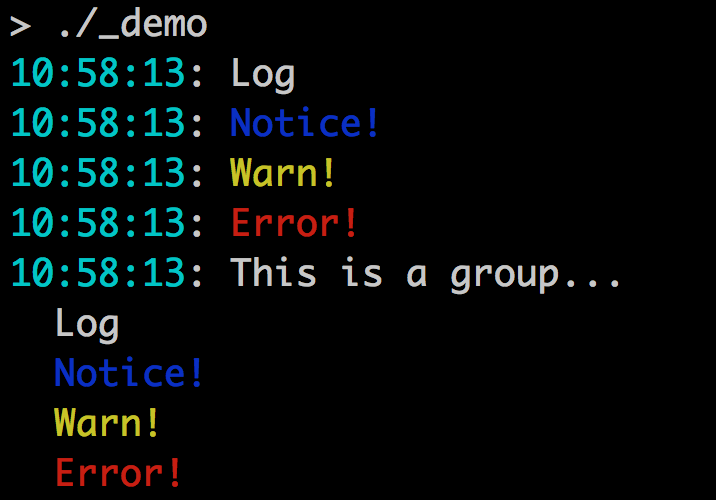

# termlog: Logging for interactive terminals

# Basic usage

    l := termlog.NewLog()
    l.Say("Log")
    l.Notice("Notice!")
    l.Warn("Warn!")
    l.Shout("Error!")

Each log entry gets a timestamp.

# Groups

Entries can be grouped together under one timestamp, with subsequent lines
indented:

    g = l.Group()
    g.Say("This line gets a timestamp")
    g.Say("This line will be indented with no timestamp")
    g.Done()

Groups must be marked as .Done() before output is produced - a good use for
defer. Termlog ensures that all grouped entries appear together in output.

# Named logs

Log entries can be named using the *As methods:

    l := termlog.NewLog()
    l.Say("hello")
    l.SayAs("debug", "Some debugging info")

Named entries are always silenced, unless they've been enabled specifically, like so:

    l.Enable("debug")
